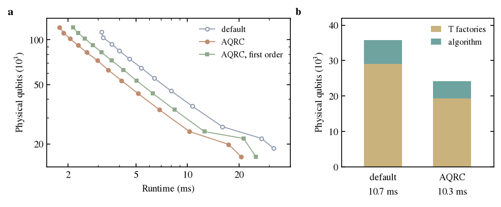

# LiH resource estimates with AQRC error budgets

The Azure Quantum Resource Estimator converts logical counts into physical resources under one error budget, split into logical errors, T states and rotation synthesis. This folder runs it on the LiH circuit of the research note, once with the estimator's default budget and once with the budget that AQRC derives from chemical accuracy. The estimator is the one in the `qdk` Python package, with gate-based qubits at a physical error rate of 1e-3 and the surface code.

## Input

The circuit has 6 logical qubits, 40 rotations and 6 measurements. Each rotation acts on a qubit used by the rotation before it, so the rotation depth is 40.

The default budget is 1e-3, split equally between the three parts.

The AQRC budget translates the energy target of 1.6 mHa into the same three parts. The logical part is the memory budget of the AQRC allocation, 4.74e-4 Ha, divided by the mean energy shift per logical error, 0.182 Ha. The mean is taken over all time slices and qubits of the circuit and over X and Z errors. This gives a probability of 2.6e-3. The rotation part is the sum of the synthesis precisions that AQRC assigns to the 40 rotations, 0.26. On this converged circuit the energy is quadratic in the synthesis error, and each rotation tolerates an error of 5e-3 to 1e-2. The value 0.26 is the estimator setting that realises this allocation, not a failure probability. The T-state part is left at the default.

A third budget, labelled first order, keeps the logical part and sets the rotation part to δ_syn/(2σ_H) = 0.027. Here δ_syn = 1.1e-3 Ha is the synthesis part of the energy budget, and 2σ_H = 0.041 Ha is the first-order bound on the energy response to a coherent error for the LiH ansatz truncated to three generators, whose residual error is 1e-3 Ha. It describes a circuit that is not converged, for which synthesis errors enter at first order.

## Results

| | default | AQRC | first order |
|---|---:|---:|---:|
| logical budget | 3.3e-4 | 2.6e-3 | 2.6e-3 |
| rotation budget | 3.3e-4 | 0.26 | 0.027 |
| code distance | 13 | 11 | 11 |
| T states per rotation | 14 | 9 | 11 |
| T states | 560 | 360 | 440 |
| T factories | 11 | 11 | 12 |
| physical qubits | 113,240 | 111,320 | 121,000 |
| runtime (ms) | 3.15 | 1.91 | 2.14 |

These estimates use the number of factories the estimator chooses. The factories hold 94% of the physical qubits, so the smaller code distance changes the total by 2% while the runtime drops by 39%.



(a) Physical qubits against runtime as the number of T factories varies. (b) Physical qubits near 10 ms of runtime, split into factories and algorithm, for the default budget with three factories and the AQRC budget with two.

Both AQRC budgets lie below the default over the whole frontier. Near 10 ms the default budget needs 35,800 physical qubits and the AQRC budget 24,200. The difference is one factory and one step in code distance. The smallest configurations need 18,680 qubits and 32.0 ms with the default budget, and 16,440 qubits and 20.6 ms with the AQRC budget.

## Remarks

Most of the change comes from the rotation part. The default budget asks for a synthesis error near 1e-5 per rotation. A converged state tolerates about 1e-2, and a state with a residual error of 1e-3 Ha still tolerates about 7e-4. The per-qubit and per-rotation resolution of AQRC does not enter here. The change comes from stating the accuracy target on the energy and translating it into the budget of the estimator.

The translation of the memory part uses the mean sensitivity and treats logical X and Z errors alike. The estimator uses its own logical error model and layout, with 20 logical qubits for the 6 data qubits, not the Stim fit and time model of AQRC. The T-state part is not derived from the sensitivity tensor. This version of the estimator is being replaced by `qdk.qre`, and the comparison has not been repeated there.

## Run

```
pip install qdk
python results/azure_estimator/compare.py
python results/azure_estimator/plot.py
```

`compare.py` reads the LiH inputs and the allocation from `data/` and writes `qre_comparison.json`. `plot.py` writes `frontier.pdf` and `frontier.png`.
